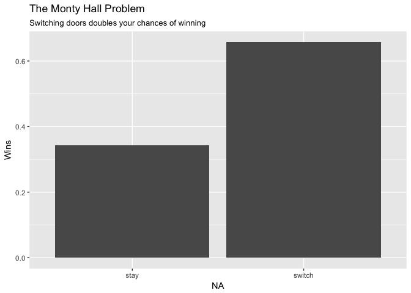
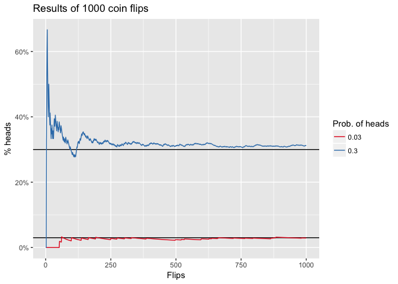

# Chapter 1: Probability


```r
library(tidyverse)
```

# Monty Hall Problem

A prize is placed at random behind one of three doors. You pick a door, then Monty chooses one of the other two doors, opens it and shows you that it is empty. He then gives you the chance to switch doors. Should you?


```r
# set up 10000 experiments
n <- 10000
# randomly choose a door to put the prize behind
prize <- sample(1:3, n, replace = TRUE)
# assume you randomly pick a door
choice <- sample(1:3, n, replace = TRUE)
# finally monty picks a door to open
# it can't be the door with the car, or the one you opened
# first redefine sample to avoid odd behaviour when length(x) == 1
sample_safe <- function(x, size, ...) {
  if (length(x) == 1) {
    return(rep(x, size))
  } else {
    return(sample(x, size, ...))
  }
}
opened <- map2_int(prize, choice, ~sample_safe(setdiff(1:3, union(.x, .y)), 1))
# the door you pick if you switch
switched <- map2_int(choice, opened, ~setdiff(1:3, union(.x, .y)))
results <- tribble(~outcome, ~wins,
                   "switch", sum(switched == prize) / length(prize),
                   "stay",   sum(choice == prize) / length(prize))
ggplot(results, aes(x = outcome, y = wins)) +
  geom_col() + 
  labs(x = NA, y = "Wins",
       title = "The Monty Hall Problem",
       subtitle = "Switching doors doubles your chances of winning")
```

<!-- -->

# Exercise 21

Suppose a coin has propability p of landing heads up. For a simulation of n = 1,000 flips, plot the propotion of heads as a function of n for p = 0.3 and 0.03.


```r
n <- 1000
# n random bernoulli
results <- tibble(n = 1:n,
                  p_thirty = rbinom(n, 1, 0.3),
                  p_three = rbinom(n, 1, 0.03)) %>% 
  gather(p, heads, -n) %>% 
  mutate(p = ifelse(p == "p_thirty", 0.3, 0.03),
         heads = as.logical(heads))
# cumulative proportion of heads
results <- results %>% 
  group_by(p) %>% 
  mutate(prop = cumsum(heads) / n)
ggplot(results, aes(n, prop, colour = as.character(p))) +
  geom_hline(yintercept = 0.3) +
  geom_hline(yintercept = 0.03) +
  geom_line() +
  scale_y_continuous(labels = scales::percent) +
  scale_color_brewer("Prob. of heads", palette = "Set1") +
  labs(x = "Flips", y = "% heads",
       title = "Results of 1000 coin flips")
```

<!-- -->

# Exercise 22

Given a coin with probability of landing heads up p, suppose we flip it n times and sum of the number of heads. The random variable given by the number of heads, X, should have expectation value np. Carry out a simulation to see if the average number of heads after many trials converges to np for p = 0.3 and n = 10, 100, and 1000.


```r
ns <- c(10, 100, 1000)
p <- 0.3
# function to calculate mean number of heads of many trials
sim_x <- function(n, p, trials = 10000) {
  results <- rerun(trials, rbinom(n, 1, p)) %>% 
    map_int(sum) %>% 
    mean
  results
}
# actual vs. expected
tibble(actual = map_dbl(ns, sim_x, p = p),
       expected = p * ns) %>% 
  knitr::kable(row.names = FALSE, align = 'l')
```


actual     expected 
---------  ---------
2.9733     3        
29.9951    30       
300.1014   300      

# Exercise 23

Suppose we roll a fair die and let A = {2,4,6} and B = {1,2,3,4}. Simulate rolls to check that A and B are indepentdent.


```r
# roll 10000 dice
n <- 10000
results <- tibble(rolls = sample(1:6, n, replace = TRUE)) %>% 
  # test if in set A and/or B
  mutate(a = (rolls %% 2 == 0),
         b = rolls <= 4,
         both = a & b)
# check for independence
results %>% 
  summarize(p_a = sum(a) / n,
            p_b = sum(b) / n,
            p_ab = sum(both) / n,
            p_a_p_b = p_a * p_b) %>% 
  knitr::kable(col.names = c("P(A)", "P(B)", "P(AB)", "P(A)P(B)"),
               row.names = FALSE, align = 'l')
```


P(A)     P(B)     P(AB)    P(A)P(B) 
-------  -------  -------  ---------
0.5013   0.6723   0.3368   0.337024 

So, `P(AB) = P(A)P(B) = 1/3`. Next construct two events that aren't independent and check that this equality does not hold. Take A = {1,2,3,4} and B = {4,5,6}, so that `P(AB) = P(A)P(B|A) = (2/3) * (1/4) = 1/6` 


```r
# define events
a <- 1:4
b <- 4:6
# roll 10000 dice
n <- 10000
results <- tibble(rolls = sample(1:6, n, replace = TRUE)) %>% 
  # test if in set A and/or B
  mutate(a = rolls %in% a,
         b = rolls %in% b,
         both = rolls %in% intersect(a, b))
# check for independence
results %>% 
  summarize(p_a = sum(a) / n,
            p_b = sum(b) / n,
            p_ab = sum(both) / n,
            p_a_p_b = p_a * p_b) %>% 
  knitr::kable(col.names = c("P(A)", "P(B)", "P(AB)", "P(A)P(B)"),
               row.names = FALSE, align = 'l')
```


P(A)     P(B)     P(AB)   P(A)P(B)  
-------  -------  ------  ----------
0.6628   0.5015   0.17    0.3323942 

So `P(AB) < P(A)P(B)` because we didn't account for the dependence.
